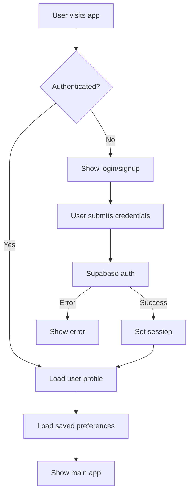
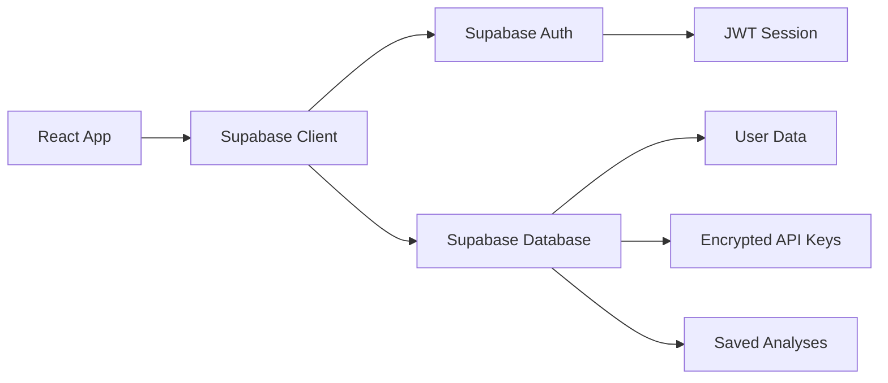

# Product Requirements Document: Supabase Authentication Integration

## Overview

### Project Name
Tortoise > Hare - Business Mapping Platform Authentication System

### Document Version
1.0

### Date
December 2024

### Author
Development Team

---

## 1. Executive Summary

This PRD outlines the integration of Supabase authentication into the existing Tortoise > Hare business mapping platform. The goal is to provide secure user authentication, personalized experiences, and data persistence capabilities while maintaining the current application's functionality and user experience.

---

## 2. Current State Analysis

### Existing Application Features
- Interactive Google Maps integration for business location analysis
- ChatGPT-powered gap analysis for business opportunities
- Business search and filtering capabilities
- Geographic overlap detection
- Demographics data integration
- Map screenshot capture for analysis

### Current User Flow
1. User enters Google Maps API key and ChatGPT API key
2. User searches for cities and business types
3. User analyzes business opportunities using AI-powered gap analysis
4. User views results in tabbed sidebar with businesses and analysis

### Current Limitations
- No user persistence - API keys and preferences lost on refresh
- No user-specific data storage
- No ability to save analysis results
- No collaborative features
- No usage tracking or analytics

---

## 3. Product Vision & Goals

### Vision Statement
Transform the Tortoise > Hare platform into a secure, personalized business intelligence tool where users can authenticate, save their work, and build upon previous analyses.

### Primary Goals
1. **Security**: Implement secure authentication to protect user data and API keys
2. **Persistence**: Enable users to save and retrieve their analysis sessions
3. **Personalization**: Provide user-specific dashboards and preferences
4. **Scalability**: Prepare the platform for multi-user collaboration features

### Success Metrics
- 90%+ successful authentication rate
- 80%+ user session persistence
- 50%+ reduction in API key re-entry
- 95%+ uptime for authentication services

---

## 4. User Stories & Requirements

### 4.1 Authentication User Stories

**As a new user, I want to:**
- Sign up with email/password so I can create a secure account
- Sign up with Google OAuth so I can quickly access the platform
- Verify my email address so my account is secure
- Reset my password if I forget it

**As a returning user, I want to:**
- Log in with my credentials so I can access my saved data
- Stay logged in across sessions so I don't have to re-authenticate frequently
- Log out securely when I'm done using the platform

**As a platform user, I want to:**
- Have my API keys securely stored so I don't need to re-enter them
- Save my analysis results so I can reference them later
- Access my search history so I can revisit previous locations and business types
- Set preferences for default search parameters

### 4.2 Data Management User Stories

**As an authenticated user, I want to:**
- Save my current map view and search parameters
- Create named projects for different analysis scenarios
- Share analysis results with team members (future enhancement)
- Export my analysis data in various formats

---

## 5. Technical Requirements

### 5.1 Authentication Methods

#### Primary Authentication
- **Email/Password**: Standard email-based authentication with secure password requirements
- **Password Requirements**: Minimum 8 characters, at least one uppercase, one lowercase, one number
- **Email Verification**: Required for account activation

#### Social Authentication (Phase 2)
- **Google OAuth**: Integration with Google for streamlined signup/login
- **GitHub OAuth**: For developer users (optional)

### 5.2 Security Requirements

- **Password Hashing**: Supabase's built-in bcrypt hashing
- **Session Management**: JWT-based sessions with configurable expiration
- **API Key Encryption**: User API keys encrypted at rest
- **HTTPS Only**: All authentication traffic over HTTPS
- **Rate Limiting**: Protection against brute force attacks

### 5.3 Database Schema

#### Users Table
```sql
CREATE TABLE users (
  id UUID PRIMARY KEY DEFAULT gen_random_uuid(),
  email VARCHAR UNIQUE NOT NULL,
  created_at TIMESTAMP WITH TIME ZONE DEFAULT NOW(),
  updated_at TIMESTAMP WITH TIME ZONE DEFAULT NOW(),
  email_verified BOOLEAN DEFAULT FALSE,
  last_login TIMESTAMP WITH TIME ZONE
);
```

#### User Profiles Table
```sql
CREATE TABLE user_profiles (
  id UUID PRIMARY KEY DEFAULT gen_random_uuid(),
  user_id UUID REFERENCES users(id) ON DELETE CASCADE,
  display_name VARCHAR,
  google_maps_api_key_encrypted TEXT,
  chatgpt_api_key_encrypted TEXT,
  default_search_radius DECIMAL DEFAULT 0.5,
  default_business_count INTEGER DEFAULT 20,
  default_rating_filter DECIMAL DEFAULT 1.0,
  created_at TIMESTAMP WITH TIME ZONE DEFAULT NOW(),
  updated_at TIMESTAMP WITH TIME ZONE DEFAULT NOW()
);
```

#### Saved Analyses Table
```sql
CREATE TABLE saved_analyses (
  id UUID PRIMARY KEY DEFAULT gen_random_uuid(),
  user_id UUID REFERENCES users(id) ON DELETE CASCADE,
  project_name VARCHAR NOT NULL,
  city_name VARCHAR,
  business_type VARCHAR,
  map_center_lat DECIMAL,
  map_center_lng DECIMAL,
  search_parameters JSONB,
  analysis_results JSONB,
  map_screenshot_url TEXT,
  created_at TIMESTAMP WITH TIME ZONE DEFAULT NOW(),
  updated_at TIMESTAMP WITH TIME ZONE DEFAULT NOW()
);
```

#### User Sessions Table (Optional - Supabase handles this)
```sql
CREATE TABLE user_sessions (
  id UUID PRIMARY KEY DEFAULT gen_random_uuid(),
  user_id UUID REFERENCES users(id) ON DELETE CASCADE,
  session_token VARCHAR NOT NULL,
  expires_at TIMESTAMP WITH TIME ZONE NOT NULL,
  created_at TIMESTAMP WITH TIME ZONE DEFAULT NOW()
);
```

### 5.4 Environment Variables

```env
# Supabase Configuration
VITE_SUPABASE_URL=your_supabase_project_url
VITE_SUPABASE_ANON_KEY=your_supabase_anon_key
SUPABASE_SERVICE_ROLE_KEY=your_service_role_key

# Encryption Keys
VITE_ENCRYPTION_KEY=your_encryption_key_for_api_keys

# Application URLs
VITE_APP_URL=http://localhost:5173
VITE_REDIRECT_URL=http://localhost:5173/auth/callback
```

---

## 6. User Interface Requirements

### 6.1 Authentication Components

#### Login Form
- Email input field with validation
- Password input field with show/hide toggle
- "Remember me" checkbox
- "Forgot password?" link
- "Don't have an account? Sign up" link
- Loading states and error handling

#### Signup Form
- Email input with real-time validation
- Password input with strength indicator
- Confirm password field
- Terms of service checkbox
- "Already have an account? Log in" link
- Email verification notice

#### User Menu (Authenticated State)
- User avatar/initials
- Display name or email
- "Profile Settings" option
- "Saved Analyses" option
- "Logout" option

### 6.2 Profile Management

#### Profile Settings Page
- Edit display name
- Change password
- Manage API keys (with encryption notice)
- Set default search preferences
- Account deletion option

#### Saved Analyses Dashboard
- List of saved projects with thumbnails
- Search and filter saved analyses
- Quick load functionality
- Delete saved analyses

### 6.3 Integration Points

#### API Key Management
- Move API key inputs to profile settings
- Auto-populate from saved profile
- Secure storage indicator
- Option to use session-only keys

#### Save Analysis Feature
- "Save Analysis" button in main interface
- Quick save with auto-generated names
- Save dialog with custom project naming
- Success/error notifications

---

## 7. Implementation Plan

### Phase 1: Core Authentication (Sprint 1-2)
**Duration**: 2 weeks

**Deliverables**:
- Supabase project setup and configuration
- User registration and login functionality
- Basic email/password authentication
- Password reset functionality
- User session management
- Protected routes implementation

**Tasks**:
1. Set up Supabase project and configure environment
2. Install and configure Supabase client in React app
3. Create authentication components (Login, Signup, ForgotPassword)
4. Implement authentication context and hooks
5. Add route protection for authenticated features
6. Create user profile basic structure

### Phase 2: Data Persistence (Sprint 3-4)
**Duration**: 2 weeks

**Deliverables**:
- API key encryption and storage
- User preferences persistence
- Saved analysis functionality
- Profile management interface

**Tasks**:
1. Implement secure API key storage
2. Create user profile management interface
3. Add save/load analysis functionality
4. Implement user preferences
5. Create saved analyses dashboard
6. Add data migration for existing users

### Phase 3: Enhanced Features (Sprint 5-6)
**Duration**: 2 weeks

**Deliverables**:
- Social authentication (Google OAuth)
- Advanced profile features
- Analysis sharing capabilities
- Performance optimizations

**Tasks**:
1. Integrate Google OAuth
2. Add analysis export functionality
3. Implement analysis sharing (basic)
4. Add user onboarding flow
5. Performance testing and optimization
6. Documentation and user guides

---

## 8. Technical Architecture

### 8.1 Authentication Flow



### 8.2 Data Flow



### 8.3 Security Architecture

- **Frontend**: React app with Supabase client
- **Authentication**: Supabase Auth with JWT tokens
- **Database**: Supabase PostgreSQL with Row Level Security (RLS)
- **API Key Storage**: AES-256 encryption for sensitive data
- **Session Management**: HTTP-only cookies for token storage

---

## 9. Testing Strategy

### 9.1 Unit Tests
- Authentication component testing
- API key encryption/decryption
- User profile CRUD operations
- Session management

### 9.2 Integration Tests
- Complete authentication flows
- Data persistence across sessions
- API key usage with external services
- Error handling scenarios

### 9.3 End-to-End Tests
- User registration and verification
- Login and logout flows
- Save and load analysis workflows
- Cross-browser compatibility

### 9.4 Security Testing
- Authentication bypass attempts
- SQL injection prevention
- XSS protection
- API key exposure checks

---

## 10. Deployment & DevOps

### 10.1 Environment Setup
- **Development**: Local Supabase instance or development project
- **Staging**: Dedicated Supabase staging project
- **Production**: Production Supabase project with backups

### 10.2 CI/CD Pipeline
- Automated testing on pull requests
- Environment variable validation
- Database migration scripts
- Deployment to Vercel/Netlify with environment-specific configs

### 10.3 Monitoring
- Supabase dashboard monitoring
- Authentication success/failure rates
- API usage patterns
- Error tracking with Sentry (optional)

---

## 11. Risk Assessment & Mitigation

### 11.1 Technical Risks

**Risk**: API key exposure or theft
- **Mitigation**: Strong encryption, secure storage, audit logs

**Risk**: Authentication service downtime
- **Mitigation**: Graceful degradation, local session fallback

**Risk**: Data loss during migration
- **Mitigation**: Comprehensive backups, staged rollout

### 11.2 User Experience Risks

**Risk**: Complex authentication flow deterring users
- **Mitigation**: Simple, intuitive UI with clear onboarding

**Risk**: Loss of current session data during implementation
- **Mitigation**: Migration tools, clear communication

---

## 12. Success Criteria & KPIs

### 12.1 Technical KPIs
- Authentication success rate: >95%
- Page load time impact: <500ms additional
- API key security: 100% encrypted storage
- Session persistence: >90% of users stay logged in

### 12.2 User Experience KPIs
- User adoption of authentication: >70% signup rate
- Time to first analysis: <2 minutes for returning users
- User retention: >60% weekly active users
- Support tickets related to auth: <5% of total tickets

### 12.3 Business KPIs
- Reduced API key management overhead
- Increased user engagement through saved analyses
- Foundation for premium features and collaboration tools

---

## 13. Future Enhancements

### 13.1 Short-term (3-6 months)
- Team collaboration features
- Advanced analytics and reporting
- API usage tracking and limits
- Mobile responsive improvements

### 13.2 Long-term (6-12 months)
- Multi-tenant organization support
- Advanced sharing and permissions
- Integration with business data sources
- White-label solutions

---

## 14. Dependencies & Assumptions

### 14.1 External Dependencies
- Supabase service availability and reliability
- Google Maps API quotas and pricing
- ChatGPT API access and rate limits
- Browser support for modern JavaScript features

### 14.2 Internal Dependencies
- Existing codebase stability
- Development team availability
- Design resources for UI components
- QA resources for comprehensive testing

### 14.3 Assumptions
- Users will accept mandatory authentication for enhanced features
- Current users will migrate to authenticated accounts
- Supabase will meet our scaling requirements
- No major breaking changes in dependent APIs

---

## 15. Appendix

### 15.1 Supabase Feature Utilization
- **Auth**: Email/password, OAuth providers, email verification
- **Database**: PostgreSQL with Row Level Security
- **Storage**: For future file uploads (map screenshots, exports)
- **Edge Functions**: For API key encryption/decryption (if needed)
- **Realtime**: For future collaboration features

### 15.2 Migration Strategy
1. Implement authentication alongside existing functionality
2. Provide opt-in migration for current users
3. Gradual rollout with feature flags
4. Maintain backward compatibility during transition period
5. Full migration with deprecation notices

---

**Document Status**: Draft v1.0  
**Next Review**: After technical feasibility assessment  
**Approvers**: Development Lead, Product Owner, Security Review
